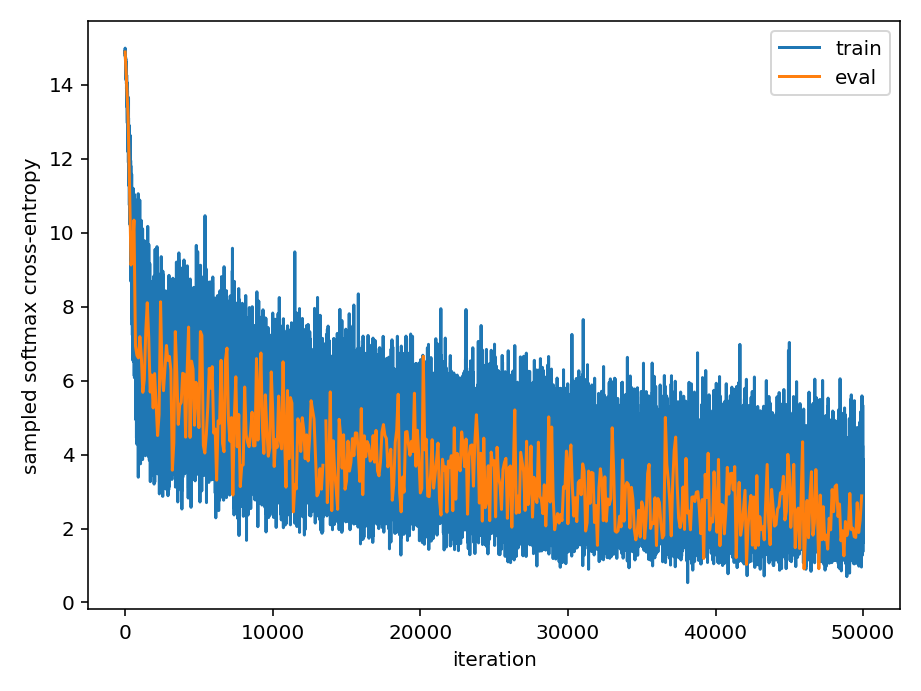

# 🎶 trecs: Transformer-Based Playlist Recommendation

This repository implements a transformer architecture to complete Spotify playlists given a set of seed tracks. The model is trained on the [Million Playlist Dataset](https://www.aicrowd.com/challenges/spotify-million-playlist-dataset-challenge) (MPD).

It can easily be extended to integrate artist, album, and audio features, as well as implicit user taste and expressed user preferences for a particular session.

## 🌟 Highlights

## 🏗️ Architecture

The model is a 6-layer causal transformer with 8 heads, 128 embedding dimensions, pre-layer norm, and 0.1 dropout during training. The feed-forward network of each transformer block is a two-layer dense network with ReLU activations and hidden dimension of 256. The model uses weight-tying, i.e., the output head is identical to the token embeddings. We use token-based positional encodings (as opposed to Fourier-style positional encodings) with a maximum context length of 50 tracks.

Tracks are treated as individual tokens because limited semantic information is available in the MPD. Semantic embeddings or semantic side information could be more easily integrated for content such as movies (e.g., using reviews and synopses) or podcasts (e.g., using concise vectors obtained through pre-trained encoders like DistilBERT applied to transcripts). The tokenizer is thus a lookup from track uri to continuous integers, each representing a 128-dimensional embedding. The embedding dimension is small because the training set comprises approximately two million tracks, corresponding to about one Gigabyte of embeddings. This is not large for modern standards, but large enough to make my laptop sweat.

## 🏋️ Training

This section outlines how to train the transformer model from scratch—taking only about 48 hours on a 2020 laptop.

### ▶️ Runtime Environment

The runtime environment is managed through [`uv`](https://docs.astral.sh/uv/). Make sure `uv` is installed and run `uv sync` to set up the environment. You can validate the installation by running `uv run pytest`.

### 📊 Data

Download the [Million Playlist Dataset](https://www.aicrowd.com/challenges/spotify-million-playlist-dataset-challenge) from AIcrowd and place the archive at `data/spotify_million_playlist_dataset.zip`. Then run `uv run make data/mpd.db` which transforms the data into a sqlite database and takes about 15 minutes. This may seem cumbersome but facilitates efficient queries to generate training data on the fly and persists train-validation-test splits, ensuring there is no accidental data leakage that might affect evaluation. For details, see [`schema.sql`](./src/trecs/schema.sql) and the [`build_db.py`](./src/trecs/scripts/build_db.py) script.

The dataset is split into train-validation-test sets with 80-10-10 ratio. The model must be able to handle `<unk>` tokens which often appear in samples from the validation set because there may be tracks in the validation set that are not in the training set. This is important for two reasons. First, we would not be able to evaluate the validation loss without accounting for unknown tokens. Second, the model would not be able to predict tracks beyond the first `<unk>` token it encounters in playlists from the validation set. Injecting `<unk>` tokens during training addresses both challenges because the model learns to ignore `<unk>` tokens and assigns a low but non-negligible probability to `<unk>`. This may seem like leakage from the validation set, but we can easily estimate the expected fraction of `<unk>` tokens in a production environment. If a playlist is shorter than the 50-track context size, we pad with `<eop>` tokens, representing the end of a playlist.

### ⚙️ Model Implementation and Training Details

The model is implemented in Flax NNX on top of JAX, using Google's Orbax for checkpointing and Grain for data loading with a custom data source implementation to fetch data from the sqlite database. The Orbax-Grain combination facilitates fully reproducible training because model, optimizer, and data loader states can be saved and restored.

The model is trained using batch size 16 for one epoch, corresponding to 50000 iterations. We use the AdamW optimizer with constant learning rate 0.0005 and weight decay 0.01. Playlist samples are drawn uniformly at random without replacement from the training set for each epoch. The validation loss is evaluated on a single batch every 100 iterations, and the model is checkpointed every 1000 iterations. Training progress is monitored using TensorBoard.

Evaluating the softmax cross-entropy for next-token prediction as the loss function is computationally prohibitive for large vocabularies, and we use a sampled softmax-cross entropy evaluation. Sampling is applied at the embedding level such that the logits for tokens not included in the contrastive sample do not need to be evaluated. We use a sample size of 20, reducing the computational burden of evaluating the loss by five orders of magnitude.

As shown in the figure above (and as we might expect based on a single training epoch), the training and validation losses decrease consistently and reach a loss around 3—because the loss is sampled and biased (see below), this is not equivalent to the log perplexity. Nevertheless, we expect the model to have learned *something*. Running a second epoch and introducing a learning rate schedule could further improve the results.

## 🪄 Inference

We directly sample from the next-token distribution with top-$k$ sampling with unit temperature to preserve diversity while preventing sampling of low-probability tokens that, together, make up a non-negligible probability mass. The top few most likely token often have significant posterior mass such that top-$p$ sampling would likely be close to greedy decoding. Greedy decoding did not generate desirable playlists in experiments. Top-$k$ sampling has two additional benefits. First, top-$k$ sampling can be performed efficiently even for *very* large vocabularies because it is equivalent to [$k$-nearest neighbors search (with dot-product norm)](https://en.wikipedia.org/wiki/Maximum_inner-product_search) in the output head of the transformer, using the embedding of the last token as the query.

`<unk>` tokens are assigned zero probability because we can't predict unknown songs (although predicting out-of-vocab would become feasible with artist, album, and audio context). We also mask out `<eop>` tokens to generate playlists that fill the entire context window. Because `<eop>` tokens appear in a large number of playlists (except the ones that exceed the context window size), they are likely to be predicted, often ending playlist generation early. Alternatively, we could artificially down-weight the probability of the `<eop>` token to control typical playlist length. We also assign zero probability to tracks that already occur in the playlist to prevent repetition.

## 🚀 Next Steps

* We should prepend a special `<start>` token to all playlists because the first token is never used as a label.
* The sampled softmax cross-entropy is biased due to the non-linearity in the denominator. We should be able to apply a low-order bias correction to get a better estimate, although it remains to be established if the bias affects the gradients. The bias leads to an *optimistic* estimate of the perplexity (see appendix for details). First-order bias correction is definitely feasible for the loss.
* The model can be readily extended to include album, artist, and stylistic coherence as well as conditioning on a representation of user taste or expressed user preference for a particular session—future work.

## 📒 Appendix

### Bias of Sampled Softmax Cross-Entropy

The (naive) sampled softmax cross-entropy is $-\log \xi_i + \log\left(\frac{n}{\left\vert S\right\vert}\sum_{j\in S} \exp \xi_j\right)$, where $\xi$ are token logits and $n$ is the vocabulary size and $S$ is a random sample of negatives, i.e., not the target token $i$. While the sum is an unbiased estimator of the desired quantity, the $\log$ non-linearity leads to a bias. For any random variable $x$, $\mathbb{E}\left[\log x\right]=\mathbb{E}\left[\log\left(\bar x+\delta\right)\right]\approx \log\bar x-\frac{\sigma^2}{2\bar{x}^2}$ to second order in a perturbation $\delta$ about the mean $\bar x$. The first-order term vanishes due to $\mathbb{E}\left[\delta\right]=0$ by assumption, and $\mathrm{var}\,\delta=\sigma^2$. In other words, our sampled softmax is somewhat optimistic.
